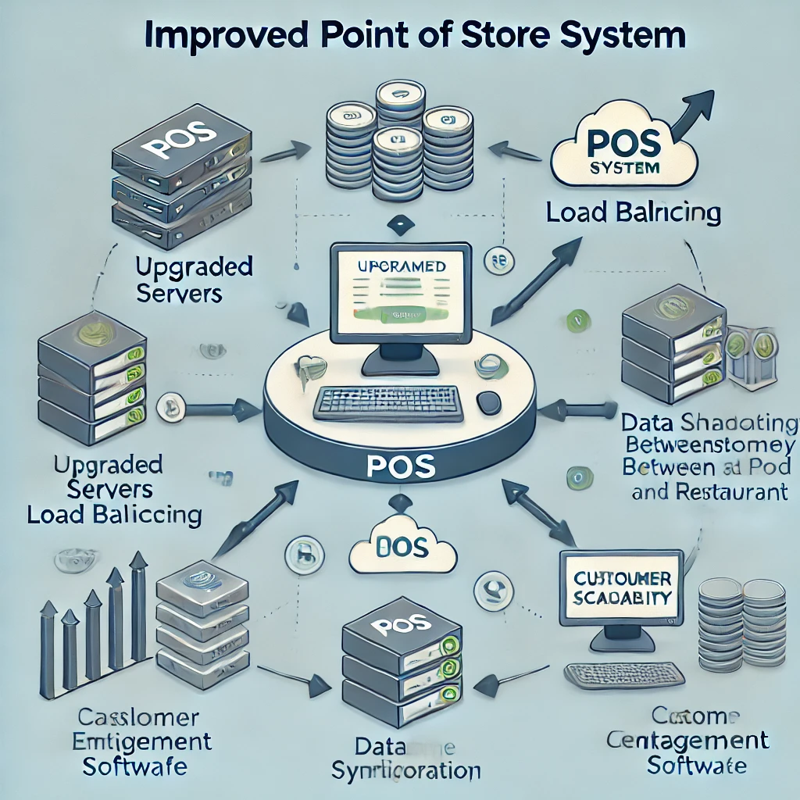

# Assignment 1: POS System Integration Analysis and Optimization Proposal

## Introduction:

Beijing Bytes, a rapidly expanding restaurant chain, has integrated a new Point of Sale (POS) system to streamline customer transactions and stock management. However, issues such as **system outages during busy periods and delays in data synchronization** between the POS system and customer engagement software have surfaced, affecting overall efficiency. This analysis identifies the root causes of these problems and offers feasible solutions to optimize the integration.

## Challenges Identified:

### 1.System Outages During Peak Hours:

Frequent **crashes and downtime**during high-traffic periods, leading to interruptions in order processing and negatively impacting customer experience. 

### 2.Delayed Data Synchronization:

**Slow updates** between the POS system and the customer engagement software, resulting in inconsistent data for stock levels, customer information, and order history.

### 3.Limited System Scalability:

The current setup may not be **robust enough to handle future growth** as the chain expands to new locations.

## Pain Points:

### 1.Overloaded Servers:

The current server setup might not be equipped to handle **large volumes of transactions**, leading to system crashes during peak hours.

### 2.Inefficient Data Transfer:

Data synchronization between the POS system and customer engagement software likely uses **inefficient or outdated methods**, causing delays and mismatches.

### 3.Lack of Monitoring and Alerts:

The absence of **real-time performance monitoring** makes it difficult to predict and prevent outages or slowdowns.

## Proposed Solutions:

### Upgrade Server Infrastructure and Introduce Load Balancing:

#### Action Plan:

Increase the server capacity to accommodate higher transaction loads. Implement **load balancing** to distribute incoming requests across multiple servers, ensuring no single server is overwhelmed during busy times.

#### Expected Outcome:

 This will **reduce system outages**, ensure smooth transactions during peak hours, and improve customer experience.

### Optimize Data Synchronization with Batch Processing or Real-time Sync:

#### Action Plan: 

Implement **batch processing** for data synchronization during non-peak hours or upgrade the system for **real-time synchronization** using message queues or other asynchronous methods.

#### Expected Outcome: 

This will **minimize data delays**, keep stock and customer records accurate, and enable faster decision-making based on up-to-date information.

### Implement Real-time Monitoring and Automated Alerts:

#### Action Plan: 

Set up a **real-time monitoring system** to track server performance, transaction loads, and data sync issues. **Automated alerts** will notify the team of potential problems before they escalate into larger issues.

#### Expected Outcome:

 Early detection of issues will **prevent outages** and ensure prompt resolution, minimizing disruptions to restaurant operations.

### Cloud-based Scalability:

#### Action Plan:

 Migrate the POS system infrastructure to a **cloud-based platform** that can scale up resources automatically based on demand.

#### Expected Outcome:

 This solution will **future-proof the system**, allowing it to handle increased traffic as the business grows without manual intervention.

## Process Documentation:

#### Current System Analysis:

- Review the POS system logs to identify **patterns leading to outages and synchronization delays**. Conduct interviews with restaurant staff to understand how these issues are affecting operations.

#### Solution Implementation:

- Upgrade server infrastructure and implement **load balancing**.

- Enhance data synchronization processes for **real-time updates** or schedule efficient batch processes.

- Set up **real-time monitoring** tools and automated alerts for system health and performance.

#### Testing Phase:

- **Perform stress tests** during peak hours to ensure that the upgraded system can handle high traffic loads.

Conduct **synchronization tests** to verify that data between the POS system and customer engagement software is being updated in real-time or as per schedule.

- **Deployment and Monitoring:**

- **Roll out the optimized system** across all branches, monitor for any issues, and gather feedback from staff for continuous improvement.

## Communication Plan:

### Management Updates:

Regularly communicate the **progress of the system upgrades** and provide detailed reports on expected improvements to the management team.

### Staff Training:

Provide simple training sessions for **restaurant staff** to familiarize them with the new system and how it improves their workflow.

#### Feedback Collection:

Set up a feedback loop to **gather input from staff** on system performance after the changes are implemented, ensuring any remaining issues are addressed.

## Conclusion:

By **upgrading the server infrastructure**, improving data synchronization processes, and introducing **real-time monitoring**, Beijing Bytes can overcome the current challenges with its POS system. These improvements will **reduce system downtime**, speed up data updates, and ensure the system can scale efficiently as the restaurant chain grows, resulting in better customer service and streamlined operations.

